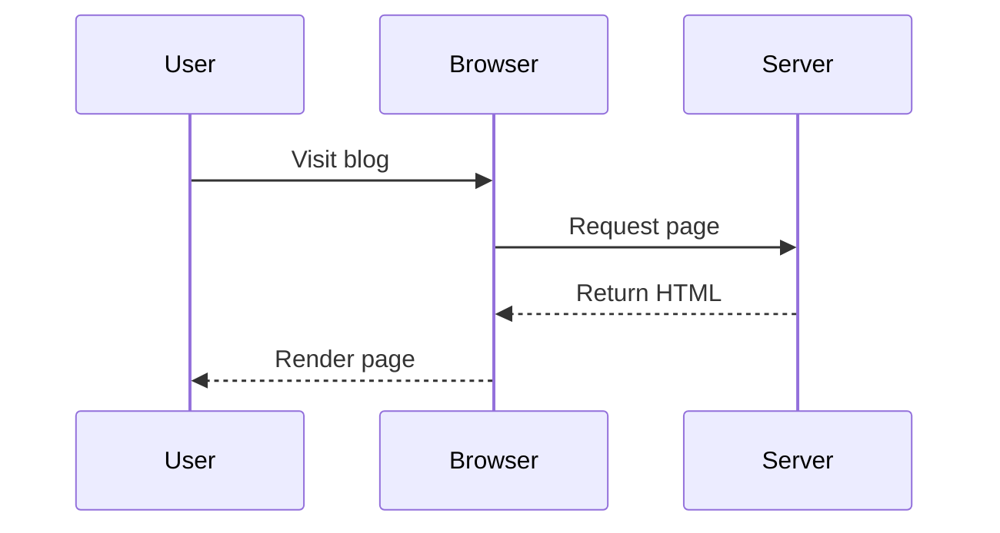
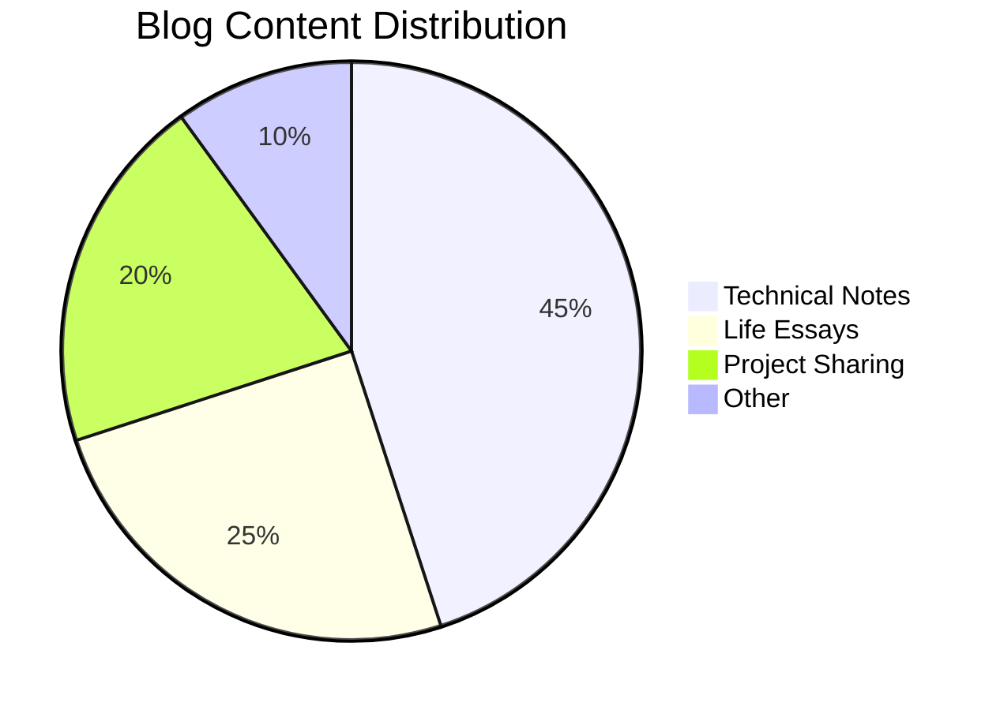

This article demonstrates all Markdown enhanced features supported by astro-koharu.

## Link Embedding

astro-koharu supports automatic embedding of standalone links, including Tweet and general link previews.

### Tweet Embedding Test

Below is a standalone Twitter link that should be automatically converted to a Tweet component:

https://twitter.com/vercel_dev/status/1997059920936775706

This is a link in normal paragraph [Vercel Tweet](https://twitter.com/vercel_dev/status/1997059920936775706), which should not be embedded.

Tweet using the new domain x.com:

https://x.com/vercel_dev/status/1997059920936775706

### General Link Preview Test

This is a link in paragraph [react-tweet](https://github.com/vercel/react-tweet), which should not be embedded.

Below is a standalone regular link that should display an OG preview card:

https://github.com/vercel/react-tweet

This is a link without OG image

https://react-tweet.vercel.app/

This is a link that cannot retrieve OG information

https://zhuanlan.zhihu.com/p/1900483903984243480

### Codepen Link Embedding

https://codepen.io/botteu/pen/YPKBrJX/

### Link Embedding Rules

- Standalone Twitter/X links are automatically converted to Tweet components
- Standalone other links display OG preview cards
- Links within paragraphs remain as is
- Supports dark/light theme switching

## Code Highlighting

Supports syntax highlighting for multiple programming languages and automatically follows theme switching.

### JavaScript

```javascript
function greet(name) {
  console.log(`Hello, ${name}!`);
  return {
    message: "Welcome to astro-koharu",
    timestamp: Date.now(),
  };
}

greet("World");
```

### TypeScript

```typescript
interface BlogPost {
  title: string;
  date: Date;
  tags: string[];
  content: string;
}

const post: BlogPost = {
  title: "My First Post",
  date: new Date(),
  tags: ["astro", "blog"],
  content: "Hello World!",
};
```

### Python

```python
def fibonacci(n: int) -> list[int]:
    """Generate Fibonacci sequence"""
    if n <= 0:
        return []
    elif n == 1:
        return [0]

    fib = [0, 1]
    for i in range(2, n):
        fib.append(fib[i-1] + fib[i-2])
    return fib

print(fibonacci(10))
```

### Bash

```bash
#!/bin/bash
# Start development server
pnpm install
pnpm dev

echo "Server is running at http://localhost:4321"
```

## GFM Tables

| Feature | Support Status |         Description |
| :------- | :------: | -----------: |
| Tables |    ✅    |     Supports alignment |
| Task lists |    ✅    |       Checkboxes |
| Strikethrough |    ✅    | ~~Delete text~~ |
| Auto-linking |    ✅    | Auto-detect URL |

## Task Lists

- [x] Install astro-koharu
- [x] Configure site information
- [ ] Write first article
- [ ] Deploy to Vercel

## Mermaid Diagrams

### Flowchart


### Sequence Diagram



### Pie Chart



## Text Styles

- **Bold text**
- _Italic text_
- ~~Strikethrough~~
- `Inline code`
- [Link text](https://github.com/cosZone/astro-koharu)

## Blockquotes

> This is a blockquote.
>
> astro-koharu makes blogging simple and elegant.

## Heading Levels

This article demonstrates h2-h6 headings, which automatically generate anchor links for easy sharing and referencing.

### Third-Level Heading

#### Fourth-Level Heading

##### Fifth-Level Heading

###### Sixth-Level Heading

## Horizontal Rule

---

## Lists

### Unordered List

- Item one
  - Sub-item A
  - Sub-item B
- Item two
- Item three

### Ordered List

1. Step one
2. Step two
   1. Sub-step A
   2. Sub-step B
      1. Sub-step C
3. Step three

## Images

Images automatically apply LQIP (Low Quality Image Placeholder) effect:


## Summary

The above demonstrates the main Markdown features supported by astro-koharu. For more features, please refer to the [Usage Guide](/post/astro-koharu-guide).
