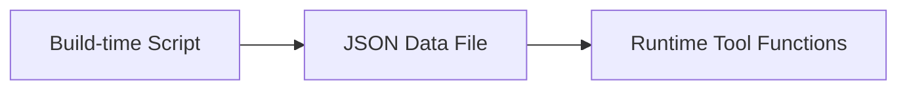

A complete user guide for the jeet-u repair documentation system to help technicians organize repair procedures, share troubleshooting guides, and manage repair databases efficiently.

https://github.com/jeet-u

## Quick Start

## Project Overview

jeet-u is a modern repair documentation system built on Astro 5.x, designed for organizing repair procedures, troubleshooting guides, and technical knowledge. Originally adapted from a blog platform, it's now optimized for repair technicians working with mobile devices, microelectronics, and component-level repair. Feel free to [fork](https://github.com/cosZone/jeet-u/fork) it to create your own repair knowledge base.

**Core Features for Repair Technicians:**

- Built on Astro 5.x with static site generation for excellent performance
- Elegant dark/light theme switching for comfortable work environments
- Backend-free full-site search powered by Pagefind for finding repair procedures
- Complete Markdown enhancement features (GFM, syntax highlighting, auto table of contents)
- Flexible multi-level categorization system (device types, repair categories, component levels)
- Multi-series support (repair series like weekly diagnostics, case studies with custom URLs)
- Responsive design for desktop reference and mobile quick lookup
- Draft feature for procedures under review and testing
- Reading progress bar and estimated time tracking for complex repairs
- Mobile-optimized repair reference header
- Repair case archive system
- RSS subscription for repair bulletins
- LQIP (Low Quality Image Placeholder) for quick-loading repair photos
- Christmas special edition (toggleable)

## Local Development - Setup Your Repair Documentation Environment

```bash
# Clone the project
git clone https://github.com/cosZone/jeet-u.git
cd jeet-u

# Install dependencies
pnpm install

# Start the development server
pnpm dev

# Build production version
pnpm build

# Preview production build
pnpm preview
```

## Deploy Your Repair Knowledge Base

Deploy your repair documentation system with one click using Vercel:

[](https://vercel.com/new/clone?repository-url=https://github.com/cosZone/jeet-u&project-name=jeet-u&repository-name=jeet-u)

## Basic Configuration

## Site Configuration

Edit the `config/site.yaml` file to configure basic site information:

```yaml
# =============================================================================
# Repair Knowledge Base Information
# =============================================================================
site:
  title: Mobile Device Repair Guides # Knowledge base title
  alternate: RepairHub # Short name
  subtitle: Professional Device & Component Repair Documentation # Subtitle
  name: Technician # Author/contributor name
  description: Comprehensive repair procedures for smartphones, tablets, and microelectronics # Description
  avatar: /img/avatar.webp # Logo/avatar
  showLogo: true # Display logo
  author: Repair Team # Documentation author
  url: https://repair-guides.example.com # Documentation URL
  startYear: 2020 # Knowledge base creation year
  keywords: # SEO keywords
    - Mobile Repair
    - Device Repair
    - Microelectronics
    - Troubleshooting
    - Repair Procedures
```

## Featured Repair Categories

Featured category cards displayed on your repair knowledge base homepage:

```yaml
featuredCategories:
  - link: mobile # Category link
    label: Mobile Device Repair # Display name
    image: /img/cover/mobile-repair.webp # Category image
    description: iPhone, Android, tablet repair procedures # Description
  - link: microelectronics
    label: Microelectronics
    image: /img/cover/microelectronics.webp
    description: Microsoldering, BGA reballing, board-level repair
  - link: components
    label: Component Repair
    image: /img/cover/components.webp
    description: Battery, screen, connector, component replacement
  # ... more categories
```

## Repair Case Studies & Series Configuration

Configure featured repair series (case studies, weekly diagnostics), supporting multiple series with independent pages:

```yaml
featuredSeries:
  - slug: case-studies      # URL path: /case-studies
    categoryName: Case Studies # Category name to match
    label: Weekly Diagnostics  # Display label
    fullName: Weekly Device Diagnostic Cases  # Full name
    description: |           # Description
      Real-world repair cases and diagnostic procedures
      Updated each week with new device repair scenarios
    cover: /img/case-studies-header.webp  # Cover image
    enabled: true
    icon: ri:tools-line      # Navigation icon
    highlightOnHome: true    # Highlight latest on homepage
    links:                   # Related links
      github: https://github.com/repair-guides
      rss: /rss.xml

  - slug: troubleshooting    # URL path: /troubleshooting
    categoryName: Troubleshooting
    label: Repair Troubleshooting
    fullName: Common Device Issues & Solutions
    description: Troubleshooting guides for common device problems
    cover: /img/troubleshooting-header.webp
    enabled: true
    highlightOnHome: false
```

## Configuration Field Description

| Field | Required | Description |
|-------|----------|-------------|
| `slug` | ✅ | URL path, e.g., `weekly` corresponds to `/weekly` |
| `categoryName` | ✅ | Category name used to match repair procedures |
| `label` | ❌ | Display label (defaults to categoryName) |
| `enabled` | ❌ | Whether to enable this series (default true) |
| `fullName` | ❌ | Full name (used for page title) |
| `description` | ❌ | Series description |
| `cover` | ❌ | Cover image path |
| `icon` | ❌ | Navigation icon (Iconify format) |
| `highlightOnHome` | ❌ | Whether to highlight latest repair procedures on homepage (default true) |
| `links` | ❌ | Related links (github, rss, etc.) |

## Social Media Configuration

Configure social media links in `config/site.yaml` to connect with your repair community:

```yaml
social:
  github:
    url: https://github.com/jeet-u
    icon: ri:github-fill # Iconify icon name
    color: "#191717" # Theme color
  bilibili:
    url: https://space.bilibili.com/your-uid
    icon: ri:bilibili-fill
    color: "#da708a"
  email:
    url: mailto:flux-tech-repair@proton.me
    icon: ri:mail-line
    color: "#55acd5"
  rss:
    url: /rss.xml
    icon: ri:rss-line
    color: "#ff6600"
  # ... more platforms
```

Supported platforms: GitHub, Twitter, Bilibili, NetEase Music, Email, RSS, etc. See `config/site.yaml` for complete configuration.

## Navigation Configuration

Customize the navigation menu in `config/site.yaml` to organize repair sections:

```yaml
navigation:
  - name: Home
    path: /
    icon: fa6-solid:house-chimney
  - name: Weekly
    path: /weekly            # Corresponds to slug: weekly in featuredSeries
    icon: ri:newspaper-line
  - name: Reading Notes
    path: /reading           # Corresponds to slug: reading in featuredSeries
    icon: ri:book-open-line
  - name: Repair Procedures
    icon: ri:quill-pen-ai-fill
    children: # Supports nested submenus
      - name: Categories
        path: /categories
        icon: ri:grid-fill
      - name: Tags
        path: /tags
        icon: fa6-solid:tags
      - name: Archive
        path: /archives
        icon: ri:archive-2-fill
  - name: Friends
    path: /friends
    icon: ri:links-line
  - name: About
    path: /about
    icon: fa6-regular:circle-user
```

> **Note**: Series page paths follow the format `/{slug}` and must match the `slug` field configured in `featuredSeries`.

## Category Mapping Configuration

Configure repair category names to URL-friendly English slugs in `config/site.yaml` for better organization:

```yaml
# =============================================================================
# Category Map
# Maps Chinese category names to URL-friendly English slugs
# =============================================================================
categoryMap:
  # Primary categories
  Essays: life
  Notes: note
  Tools: tools
  Weekly: weekly      # Used for category page /categories/weekly
  Book Excerpts: reading     # Used for category page /categories/reading
  # Secondary categories (for nested paths)
  Frontend: front-end
  # Add more as needed:
  # Backend: back-end
  # Algorithm: algorithm
```

This way, the "Essays" category URL will be `/categories/life` instead of `/categories/essays`.

> **Note**: `categoryMap` is only used for URL mapping of category pages (`/categories/*`). Series page URLs (such as `/weekly`, `/reading`) are configured separately by the `slug` field in `featuredSeries`.

## Repair Documentation System

## Creating Repair Procedures

Create Markdown files in the `src/content/blog/` directory to document comprehensive repair procedures and guides. Directory structure affects procedure categorization:

```plain
src/content/blog/
├── mobile-repair/         # Mobile device repair procedures
│   ├── iphone/
│   │   └── iphone-screen-replacement.md
│   └── android/
│       └── samsung-battery-replacement.md
├── microelectronics/      # Component-level repair
│   ├── microsoldering/
│   │   └── bga-reballing-guide.md
│   └── board-repair/
│       └── power-rail-diagnostics.md
└── troubleshooting/       # Common issues and solutions
    └── screen-not-working.md
```

Each repair procedure needs to include YAML frontmatter at the beginning:

## Required Fields for Repair Procedures

```yaml
---
title: Repair Procedure Title # Required
date: 2024-12-06 # Required, documentation/procedure date
---
```

## Common Optional Fields for Procedures

```yaml
---
title: Screen Replacement Procedure
date: 2024-12-06
updated: 2024-12-15 # Last procedure update (optional)
description: Step-by-step guide for replacing damaged phone screens # Procedure summary
link: screen-replacement-guide # Custom URL slug
cover: /img/repair-cover/screen.webp # Procedure cover image
tags: # Tags
  - Screen Repair
  - iPhone
  - LCD
categories: # Repair categories
  - Mobile Repair
subtitle: Professional screen replacement techniques # Procedure subtitle
catalog: true # Display table of contents (default true)
draft: false # Draft status (default false)
sticky: false # Pin this procedure (default false)
excludeFromSummary: false # Exclude from AI summary
---
```

## Description Field Priority

Repair procedure description priority: custom `description` > AI auto-summary > first 150 characters of Markdown content

- Recommended to write descriptions for important repair procedures for better search engine visibility
- If omitted, the system will auto-generate a summary using AI (requires running `pnpm generate:summaries`)
- If neither custom description nor AI summary exists, the system will auto-extract the first 150 characters from your procedure

## Repair Category System

The jeet-u system supports flexible repair procedure categorization for technicians:

## Single-Level Repair Categories

```yaml
categories:
  - Mobile Repair # or ['Mobile Repair']
```

Corresponding URL: `/categories/mobile-repair` (mapped by `categoryMap`)

## Multi-Level Nested Repair Categories

```yaml
categories:
  - [Mobile Repair, iPhone, Screen]
```

This creates a hierarchy: Mobile Repair → iPhone → Screen

Corresponding URL: `/categories/mobile-repair/iphone/screen`

## Tag System for Repair Classifications

Tags provide flat, hierarchical organization for repair techniques and components:

```yaml
tags:
  - Screen Repair
  - Microsoldering
  - Power Diagnostics
```

All tags are displayed on the `/tags` page. Clicking a tag shows all repair procedures with that tag.

## Draft Feature for Procedures in Development

Set `draft: true` to mark a repair procedure as draft while testing:

```yaml
---
title: iPhone XS Max Motherboard Repair
draft: true
---
```

**Behavior:**

- **Local Development** (`pnpm dev`): Drafts are visible with a "DRAFT" label on the procedure card for testing
- **Production Build** (`pnpm build`): Drafts are automatically filtered out and don't appear in any repair procedure lists

## Sticky Feature for Important Procedures

Set `sticky: true` to pin an important repair procedure:

```yaml
---
title: Important Announcement
sticky: true
---
```

**Behavior:**

- Sticky procedures appear in the "Pinned Repair Procedures" section on the knowledge base homepage
- Sticky procedures are sorted by date (newest first)
- Doesn't affect sorting on other pages (categories, tags, archives)

## Series Procedures in Repair Documentation

Repair procedures in series configured in `featuredSeries` will:

1. Have their own series page (URL determined by `slug`, e.g., `/case-studies`, `/troubleshooting`)
2. Not appear in regular procedure lists (`/procedures` or main knowledge base)
3. If the series has `highlightOnHome: true`, the latest procedure will be highlighted on the knowledge base homepage

## Example Series Procedures

```yaml
---
title: Weekly Device Diagnostic Vol.16
categories:
  - Weekly  # Corresponds to a featuredSeries' categoryName
excludeFromSummary: true  # Optional: exclude from AI summary generation
---
```

```yaml
---
title: Advanced Microsoldering Techniques
categories:
  - Case Studies  # Corresponds to another featuredSeries' categoryName
---
```

> **Tip**: For a procedure to be included in a series, its `categories` field must match the series' `categoryName` in `featuredSeries`.

## Interface Features for Technicians

## Theme Switching - Dark/Light Mode

Click the sun/moon icon in the top right to switch between dark/light modes.

**Syntax Highlighting:**

- Light mode: `github-light`
- Dark mode: `github-dark`

## Full-Site Search for Repair Procedures

Static site search powered by [Pagefind](https://pagefind.app/) helps technicians find repair guides quickly without backend server needed.

**Opening Search:**

- Click the search icon in the navigation bar
- Keyboard shortcut: `Cmd/Ctrl + K`

**Features:**

- Chinese and English word segmentation support
- Real-time search results for repair procedures
- Highlight matching keywords and techniques
- Display procedure summary, category, and metadata

## Procedure Reading Features

## Table of Contents (TOC) for Navigation

- Auto-extract repair procedure headings (h2-h6) to generate table of contents
- Use CSS counters to auto-number headings by level (e.g., 1., 1.1., 1.1.1.)
- Support disabling numbering via frontmatter's `tocNumbering: false` field
- Click TOC items to jump to corresponding sections
- Auto-highlight current section when scrolling
- Desktop: displayed on right sidebar, Mobile: collapsed

## Controlling Table of Contents Numbering

```yaml
---
title: LCD Screen Replacement Guide
tocNumbering: false # Disable TOC numbering (default true)
---
```

- By default, all repair procedures display hierarchical numbering in table of contents
- Set `tocNumbering: false` to disable numbering for specific procedures
- Numbering is implemented via CSS counters with zero runtime overhead
- Applies to both desktop sidebar and mobile dropdown TOC

## Reading Progress Bar for Long Procedures

- Displayed at the top of the page
- Updates in real-time with current reading position

## Heading Anchor Links for References

- Each heading automatically generates an ID
- Hover over headings to reveal a clickable `#` link icon
- Click to copy the URL with anchor

## Series Procedure Navigation

Previous/next procedures in the same series displayed at the bottom:

- Auto-grouped by deepest category level
- Sorted by publication date
- Display procedure title and cover image

## Reading Time Estimate

Repair procedure cards display estimated reading/working time (calculated based on procedure complexity and length).

## Mobile Procedure Reading Header

When viewing procedures on mobile devices (≤992px), the top navigation bar displays a header optimized for technician reference:

- **Circular Reading Progress** - Real-time circular progress indicator showing current reading progress
- **Current Section Title** - Display current H2/H3 section title with smooth animation on changes
- **Expandable Table of Contents** - Click the title area to expand the full procedure TOC for quick navigation to any repair step

Features:

- Auto-update current section when scrolling
- Support `prefers-reduced-motion` for reduced animations

## Responsive Design for All Devices

**Desktop:**

- Two-column layout (main content + sidebar)
- Fixed navigation bar
- Floating table of contents

**Tablet:**

- Adaptive layout adjustments
- Simplified sidebar

**Mobile:**

- Single-column layout optimized for mobile screens
- Drawer-style navigation menu (hamburger menu) for easy access
- Collapsible table of contents for quick navigation
- Touch-optimized interactions for mobile technicians
- Dedicated reading header for procedure pages (progress circle + current step title + expandable TOC)

## Advanced Features for Knowledge Base Management

## Series Management System for Organized Repairs

The `featuredSeries` configuration supports managing multiple repair series (case studies, troubleshooting guides), each automatically generating a dedicated knowledge base page:

## Dedicated Series Pages for Repair Guides

- Each enabled series has its own knowledge base page (e.g., `/case-studies`, `/troubleshooting`)
- Displays all repair procedures in that series
- Series header image with repair documentation introduction
- Related links (GitHub, RSS, community resources)

## Homepage Display of Series Procedures

- Series with `highlightOnHome: true` display their latest repair procedure highlighted on the knowledge base homepage
- Series with `highlightOnHome: false` are not displayed on homepage
- All series procedures are separate from regular procedure lists

**Configuration Example:**

```yaml
featuredSeries:
  - slug: weekly
    categoryName: Weekly
    highlightOnHome: true   # Display latest weekly digest on homepage
    # ...
  - slug: reading
    categoryName: Book Excerpts
    highlightOnHome: false  # Don't display on homepage
    # ...
```

## Archive Page for Historical Procedures

Visit `/archives` to see all repair procedures in archive view by year:

- Grouped by year of publication
- Shows repair procedure count for each year
- Timeline-style display for easy browsing
- Includes publication date, procedure title, and repair category

## Collaborator Network System

Visit `/friends` to see your collaborator network and repair community connections:

## Network Features

- Collaborator/organization card display
- Partnership application form (customizable)
- Support for organization logo, name, description, and website link

## Image Optimization with LQIP (Low Quality Image Placeholder)

LQIP (Low Quality Image Placeholder) is an image loading optimization technique that displays a low-quality placeholder before the high-quality image loads, avoiding blank spaces or layout shifts.

**Features:**

- 🎨 Auto-extract image dominant color at build time, generate CSS gradient placeholder
- ⚡ Zero runtime overhead — pure CSS implementation, no JavaScript decoding needed
- 📦 Minimal data size — only 18 characters stored per image
- 🔄 External images auto-fallback to solid color placeholder

**Supported Components:**

- Repair procedure card cover (`PostItemCard`)
- Page banner with repair category images (`Cover`)
- Category card backgrounds for device types (`CategoryCards`)
- Series cover for repair guides (`SeriesCover`)
- Sidebar organization avatar/logo (`HomeInfo`)

**Usage:**

```bash
# Generate LQIP data (processes all images in public/img/)
pnpm generate:lqips
```

**Generation Result:**

LQIP data is saved in `src/assets/lqips.json` with the following format:

```json
{
  "cover/1.webp": "87a3c4c2dfefbddae9",
  "cover/2.webp": "6e3b38ae7472af7574"
}
```

Each value is 18 hex characters (3 colors), decoded at runtime to CSS gradient:

```css
linear-gradient(135deg, #87a3c4 0%, #c2dfef 50%, #bddae9 100%)
```

**How it Works:**

1. Use sharp to scale image to 2×2 pixels
2. Extract average color from four quadrants (top-left, top-right, bottom-left, bottom-right)
3. Select 3 colors to generate 135-degree diagonal gradient
4. Store as compact hex string

**Using in Components:**

```astro
---
import { getLqipStyle, getLqipProps } from '@lib/lqip';

// Method 1: Get style string directly
const style = getLqipStyle('/img/cover/1.webp');
// Returns: "background-image:linear-gradient(...)"

// Method 2: Get complete props (supports external image fallback)
const lqipProps = getLqipProps(coverUrl);
// Local images return: { style: "background-image:..." }
// External images return: { class: "lqip-fallback" }
---

<div style={style}>
  
</div>
```

**Notes:**

- Generated `src/assets/lqips.json` must be committed to git
- Need to re-run `pnpm generate:lqips` after adding new images
- External images (starting with http/https) auto-use solid color fallback

## Related Procedures Recommendation System

Reference: [No Server, No Database: Smart Repair Procedure Recommendations in Astro with `transformers.js`](https://alexop.dev/posts/semantic-related-posts-astro-transformersjs/)

An intelligent repair procedure recommendation system based on semantic similarity, using [transformers.js](https://huggingface.co/docs/transformers.js) to generate procedure embedding vectors locally and calculate semantic similarity between repair guides.

**Features:**

- 🧠 Semantic understanding based on AI embedding models (Snowflake Arctic Embed)
- 📊 Auto-calculate procedure similarity, recommend top 5 related repair procedures
- 🚀 Pre-compute at build time, zero runtime overhead for fast recommendations
- 🔧 Support excluding specific procedures via frontmatter

**Usage:**

```bash
# Generate similarity data (run locally, auto-downloads model, ~3-5 minutes)
pnpm generate:similarities

# Generated files are committed to git for direct use on platforms like Vercel
```

## Excluding Procedures from Recommendations

Set `excludeFromSummary: true` in procedure frontmatter to exclude it from similarity calculations:

```yaml
---
title: Weekly Digest #1
excludeFromSummary: true  # Exclude this procedure from similarity and AI summary generation
---
```

> **Tip**: Series procedures (like weekly case studies) are recommended to set `excludeFromSummary: true` to avoid affecting recommendation quality for main repair procedures.

## Configuring Calculation Content for Similarity

Choose whether to include repair procedure body text in similarity calculation:

```typescript
// true: Use Title + Description + Body (more accurate, slower, ~3-5 minutes)
// false: Use Title + Description only (faster, suitable for many procedures)
const INCLUDE_BODY = true;
```

- **Include Body**: More precise similarity, can identify repair technique-level relevance, but slower generation (~219 seconds for 169 procedures)
- **Title + Description Only**: Faster generation, suitable for repair knowledge bases with detailed descriptions (~4 seconds for 169 procedures)

```bash
# Time to calculate similarities for 169 repair procedures (title+description) using Snowflake/snowflake-arctic-embed-m-v2.0
Done! Generated similarities for 169 procedures in 4.1s

# Time to calculate similarities for 169 repair procedures (title+description+body) using Snowflake/snowflake-arctic-embed-m-v2.0
Done! Generated similarities for 169 procedures in 219.3s
```

The difference is significant, but personally I prefer results with body content for better accuracy. That's why there's also an AI summarization feature.

**Model Selection:**

Default model: `Snowflake/snowflake-arctic-embed-m-v2.0`

- **Model Size**: ~90MB (auto-downloaded to `.cache/transformers` on first run)
- **Vector Dimension**: 768
- **Performance**: Balanced quality and speed, suitable for Chinese and English content
- **Generation Time**: ~3-5 minutes (169 repair procedures)

To change the model, edit `MODEL_NAME` in `src/scripts/generateSimilarities.ts`:

```typescript
const MODEL_NAME = "Snowflake/snowflake-arctic-embed-m-v2.0";
// Optional alternatives:
// const MODEL_NAME = 'sentence-transformers/all-MiniLM-L6-v2'; // Smaller and faster (~23MB), 384 dimensions
// const MODEL_NAME = 'BAAI/bge-small-zh-v1.5';  // Optimized for Chinese
```

**Other Optional Models Comparison:**

| Model                                      | Size  | Dimensions | Advantage               |
| ----------------------------------------- | ----- | ---------- | ----------------------- |
| `Snowflake/snowflake-arctic-embed-m-v2.0` | ~90MB | 768        | High quality, balanced  |
| `sentence-transformers/all-MiniLM-L6-v2`  | ~23MB | 384        | Lightweight, fast       |
| `BAAI/bge-small-zh-v1.5`                  | ~95MB | 512        | Chinese-specific        |

**Notes:**

- Need to run generation script locally (cloud platforms like Vercel cannot run large ML models)
- Generated `src/assets/similarities.json` must be committed to git for production use
- If no similarity file is generated, related procedures recommendation module won't display
- Model files are cached in `.cache/transformers` directory (added to `.gitignore`)

## Automated Summary Generation with AI

An intelligent summary generation system based on [transformers.js](https://huggingface.co/docs/transformers.js) using advanced AI models to auto-generate high-quality summaries for repair procedures and technician guides.

## Relationship Between Summary and Related Procedures

AI summary and related repair procedures features complement each other:

- **Similarity calculation** requires reading full procedure text, higher computation cost (~3-5 minutes for 169 procedures)
- **AI summary** provides quality descriptions without reading full procedure text, and generated summaries help improve similarity calculation
- Both share the same AI model caching mechanism, saving storage space

**Features:**

- 🤖 Based on advanced text generation model (Xenova/LaMini-Flan-T5-783M)
- 📝 Auto-generate summaries for repair procedures without descriptions
- ✨ Procedure detail page supports typewriter animation for display, enhancing technician experience
- 🎯 Smart fallback: prioritize custom description, auto-use AI summary if missing
- 🚀 Pre-generate at build time, zero runtime overhead
- ♿ Support accessibility and prefers-reduced-motion

**Usage:**

```bash
# Generate AI summaries (run locally, first time downloads model, ~5-10 minutes)
pnpm generate:summaries

# Generated files must be committed to git for direct use on platforms like Vercel
```

**Generation Result:**

AI summaries are saved in `src/assets/summaries.json` with the following format:

```json
{
  "iphone-screen-replacement": {
    "title": "iPhone Screen Replacement Guide",
    "summary": "Step-by-step procedure for replacing a broken iPhone display..."
  }
}
```

**Where AI Summaries Are Used**

1. **Procedure Detail Page**: Collapsible AI summary card displayed below breadcrumb navigation

   - Collapsed by default, triggered by "Expand" button
   - Expands with typewriter animation showing text character by character
   - Animation plays once, respects `prefers-reduced-motion` user preference for accessibility

2. **Procedure Card**: As description fallback in lists
   - Priority: custom `description` > AI summary > first 150 characters of Markdown
   - Auto-used in procedure lists, knowledge base homepage, category pages, etc.

**AI Model Selection for Summary Generation**

Default model: `Xenova/LaMini-Flan-T5-783M`

- **Model Size**: ~300MB (auto-downloaded to `.cache/transformers` on first run)
- **Generation Quality**: High-quality Chinese and English repair procedure summaries
- **Generation Time**: ~5-10 minutes (169 repair procedures)

To change the model, edit `MODEL_NAME` in `src/scripts/generateSummaries.ts`:

```typescript
const MODEL_NAME = "Xenova/LaMini-Flan-T5-783M";
// Optional alternatives:
// const MODEL_NAME = 'Xenova/distilbart-cnn-6-6'; // Faster, good English results
// const MODEL_NAME = 'facebook/bart-large-cnn';   // Higher quality, slower speed
```

**Configuring Summary Prompt Template**

Customize the summary generation prompt by editing `PROMPT_TEMPLATE` in `src/scripts/generateSummaries.ts`:

```typescript
const PROMPT_TEMPLATE = (title: string, content: string) =>
  `Generate a 100-150 word summary for this repair guide:
  Title: ${title}
  Content: ${content}`;
```

**Notes:**

- Need to run generation script locally (platforms like Vercel cannot run large models)
- Generated `src/assets/summaries.json` must be committed to git
- If no summary file is generated, automatically fallback to Markdown procedure text extraction
- Model files are cached in `.cache/transformers` directory (added to `.gitignore`, ~300MB)
- First run requires downloading ~300MB model, recommended on good network connection

**Best Practices for Generation**

1. **Use with similarity calculation**:

   ```bash
   # Generate summaries first
   pnpm generate:summaries
   # Then calculate similarity (can use summaries instead of full procedure text, improving speed)
   pnpm generate:similarities
   ```

2. **Selective summary generation**: Script skips procedures with existing `description` field

3. **Commit to version control**: Commit generated `src/assets/summaries.json` to git to avoid regeneration in CI/CD (important for hosting platforms like Vercel)

## Holiday Special Edition Features

Holiday-limited Christmas atmosphere special effects system with multiple independently toggleable visual effects to add festive atmosphere to your repair knowledge base.

**Features:**

- Snowfall — Canvas-based snowfall animation with foreground and background layers supporting parallax effect
- Christmas Color Scheme — Red, green, and gold theme replacing default pink-blue colors, supports dark/light modes
- Christmas Hat Decoration — Christmas hat on sidebar avatar
- Christmas Lights — Decorative light string animation on header top
- Christmas Ornament Switching — Decorative ornaments in navigation bar
- Runtime Toggle — Floating button in bottom right to toggle effects anytime, settings auto-save

**Configuration:**

Edit `christmas` configuration in `config/site.yaml`:

```yaml
christmas:
  enabled: true # Master switch
  features:
    snowfall: true # Snowfall
    christmasColorScheme: true # Christmas color scheme
    christmasCoverDecoration: true # Light string decoration
    christmasHat: true # Christmas hat
    readingTimeSnow: true # Reading time snowfall effect
  snowfall:
    speed: 0.5 # Fall speed (default 0.5)
    intensity: 0.7 # Desktop snowflake density (0-1)
    mobileIntensity: 0.4 # Mobile snowflake density (0-1)
    maxLayers: 6 # Max snowflake layers
    maxIterations: 8 # Max iterations
    mobileMaxLayers: 4 # Mobile max layers
    mobileMaxIterations: 6 # Mobile max iterations
```

**User Control:**

- Floating button (snowflake icon) in bottom right toggles Christmas effects
- User preference auto-saved to localStorage, persists across sessions
- Respects `prefers-reduced-motion` preference, auto-disables animations

**Technical Implementation:**

- Snowfall uses Canvas 2D rendering with layering for parallax effect
- Colors use CSS variables for zero runtime overhead
- State management using nanostores for cross-component sync
- Fully responsive, mobile automatically reduces snowflake density

**Disabling Christmas Effects:**

Set `christmasConfig.enabled = false` to completely disable all Christmas effects.

## Site Announcement and Notification System

Backend-free knowledge base announcement system for repair technicians, supporting announcement management in config files, auto-popup on first visit, reopenable via footer entry after dismissal.

**Features:**

- Backend-free — announcements in config file, no database needed
- Toast Notification — floating notification in bottom right, supports stacking multiple
- Multiple Announcements — support multiple announcements sorted by priority
- Time Control — set start/end dates for announcements, auto-control visibility
- Custom Colors — each announcement can have independent color overriding default type color
- Timeline Modal — announcement list uses timeline style with gradient connectors
- Hover to Mark Read — auto-mark as read after hovering Toast for 1 second
- Read Tracking — localStorage tracks read status, no re-popup on return visits
- View Again — footer entry to view all announcements anytime with unread indicator

**Configuration:**

Edit `config/site.yaml` to add announcements:

```yaml
announcements:
  - id: welcome-2026 # Unique identifier
    title: Happy New Year 2026! # Announcement title
    content: Happy New Year! Thank you all for your support~ # Announcement content
    type: info # Type: info | warning | success | important
    priority: 300 # Priority (higher displays first)
    color: "#ED788C" # Custom color (optional, overrides type default)
    publishDate: "2026-01-01" # Display date (optional, for timeline display)
    startDate: "2025-12-31T00:00:00+08:00" # Start date (optional)
    endDate: "2026-01-15T23:59:59+08:00" # End date (optional)
  - id: site-update-01
    title: Site Update Announcement
    content: New announcement system added, now supporting multiple announcements!
    type: info
    priority: 500
    color: "#6366F1"
    publishDate: "2025-01-02"
```

To add links (optional):

```yaml
announcements:
  - id: example-with-link
    title: Example Announcement
    content: Announcement content
    type: info
    link:
      url: https://example.com
      text: Learn More
      external: true
```

**Announcement Type Styles:**

| Type        | Description | Default Color       |
| ----------- | ----------- | ------------------- |
| `info`      | Info notice | Blue (#3b82f6)      |
| `warning`   | Warning     | Yellow (#eab308)    |
| `success`   | Success     | Green (#22c55e)     |
| `important` | Important   | Red (#ef4444)       |

> Set `color` field to override defaults

**Interaction Flow:**

1. **First Visit**: Auto-popup unread announcement Toast after 0.5s (multiple stack)
2. **Hover to Read**: Auto-mark read after hovering Toast for 1s
3. **Manual Close**: Close Toast by clicking Dismiss
4. **View All**: Close all Toasts and open timeline modal
5. **Timeline Modal**: Click announcement to mark read, shows publish date and gradient connectors
6. **Footer Entry**: View all announcements anytime, shows unread indicator
7. **Return Visit**: Only shows truly unread announcements

**Notes:**

- Announcement `id` must be unique for tracking read status
- Omit `startDate` for immediate effect, omit `endDate` for no expiration
- `publishDate` for timeline display, uses `startDate` if omitted
- Recommended to delete expired announcements to keep config clean
- Read status stored in localStorage with key `announcement-read-ids`

**Markdown Enhancement for Technical Repair Documentation**

**Supported Syntax:**

- GitHub Flavored Markdown (GFM)
  - Tables
  - Task lists
  - Strikethrough
  - Auto-links

## Mermaid Diagrams for Repair Workflows

Support Mermaid syntax in Markdown for repair flowcharts, diagnostic sequence diagrams, device architecture diagrams, and more.

````markdown

````


Supported diagram types:

- `flowchart` / `graph` - Flowcharts
- `sequenceDiagram` - Sequence diagrams
- `classDiagram` - Class diagrams
- `stateDiagram` - State diagrams
- `erDiagram` - ER diagrams
- `gantt` - Gantt charts
- `pie` - Pie charts
- `mindmap` - Mind maps

Diagrams automatically follow dark/light theme switching. See [Mermaid official docs](https://mermaid.js.org/) for more syntax.

**Information Diagrams for Repair Data Visualization**

Support using [@antv/infographic](https://infographic.antv.vision/) to draw beautiful information diagrams in Markdown, ideal for displaying repair processes, device comparisons, technician skill hierarchies, repair statistics, etc.

Usage: Use `infographic` marker in code blocks, specify template name on first line, then use YAML-like syntax for data:

````markdown
```infographic
infographic list-grid-badge-card
data
  title Essential Repair Tools
  desc Tools required for device repair
  items
    - label Soldering Iron
      desc Micro soldering equipment
      icon mdi/fire
    - label Multimeter
      desc Electrical diagnostics
      icon mdi/chart-line
    - label Magnifying Glass
      desc Component inspection
      icon mdi/magnify
```
````

```infographic
infographic list-grid-badge-card
data
  title Tools
  desc Tools required for device repair
  items
    - label Soldering Iron
      desc Micro soldering equipment
      icon mdi/fire
    - label Multimeter
      desc Electrical diagnostics
      icon mdi/chart-line
    - label Magnifying Glass
      desc Component inspection
      icon mdi/magnify
```

**Available Template Types:**

- **List Types** (`list-*`): Display information lists

  - `list-grid-badge-card` - Card grid layout
  - `list-grid-candy-card-lite` - Candy-style cards
  - `list-row-horizontal-icon-arrow` - Horizontal icon arrow list

- **Process/Sequence Types** (`sequence-*`): Display steps, processes, or stages

  - `sequence-zigzag-steps-underline-text` - Zigzag steps
  - `sequence-circular-simple` - Circular process
  - `sequence-roadmap-vertical-simple` - Vertical roadmap
  - `sequence-pyramid-simple` - Pyramid structure

- **Comparison Types** (`compare-*`): Binary or multi-comparison

  - `compare-binary-horizontal-simple-fold` - Horizontal binary comparison
  - `compare-swot` - SWOT analysis
  - `compare-hierarchy-left-right-circle-node-pill-badge` - Hierarchical left-right comparison

- **Hierarchy Types** (`hierarchy-*`): Display tree structures

  - `hierarchy-tree-tech-style-capsule-item` - Tech-style tree diagram
  - `hierarchy-tree-curved-line-rounded-rect-node` - Curved line tree diagram

- **Chart Types** (`chart-*`): Data visualization

  - `chart-column-simple` - Column chart
  - `chart-bar-plain-text` - Bar chart
  - `chart-pie-plain-text` - Pie chart
  - `chart-line-plain-text` - Line chart

- **Others**
  - `quadrant-*` - Quadrant analysis diagram
  - `relation-*` - Relationship diagram

**Diagram Data Field Description**

- `title` - Title (optional)
- `desc` - Description text (optional)
- `items` - Item array, each item can include:
  - `label` - Main label text
  - `value` - Numerical value (for chart templates)
  - `desc` - Description text
  - `icon` - Icon name (format: `mdi/icon-name`)
  - `children` - Child items (for hierarchical structures)

**Diagram Theme Customization**

Add a `theme` block after data to customize colors:

````markdown
```infographic
infographic sequence-pyramid-simple
data
  items
    - label Base Layer
    - label Middle Layer
    - label Top Layer
theme
  palette
    - #3b82f6
    - #8b5cf6
    - #f97316
```
````

Information diagrams automatically follow dark/light theme switching for comfortable technician reference and use the project's font. See [Infographic official docs](https://infographic.antv.vision/) for more templates and syntax.

**Code Highlighting for Technical Procedures**

- Based on Shiki
- Dual-theme support (dark/light)
- Language annotation support
- Line number display

Example:

````markdown
```javascript
function hello() {
  console.log("Hello, world!");
}
```
````

```javascript
function hello() {
  console.log("Hello, world!");
}
```

**Auto-Generated Heading Links for References**

All headings automatically generate clickable anchor links.

**Automatic Link Embedding for Resources**
Standalone special links automatically transform to embed components for easy access to repair resources:

- **Twitter/X Links**: Auto-embed Tweet component
- **CodePen Links**: Auto-embed interactive CodePen demo
- **Other Links**: Display OG preview card (includes title, description, image, etc.)

Example:

```markdown
<!-- Standalone links get embedded -->

https://x.com/vercel_dev/status/1997059920936775706

https://codepen.io/botteu/pen/YPKBrJX/

https://github.com/vercel/react-tweet

Strict anti-crawling, links without metadata

https://zhuanlan.zhihu.com/p/1900483903984243480

<!-- Links in paragraphs remain unchanged -->

This is a [regular link](https://example.com), not embedded.
```

https://x.com/vercel_dev/status/1997059920936775706

https://codepen.io/botteu/pen/YPKBrJX/

https://github.com/vercel/react-tweet

Strict anti-crawling, links without metadata

https://zhuanlan.zhihu.com/p/1900483903984243480

<!-- Links in paragraphs remain unchanged -->

This is a [regular link](https://example.com), not embedded.

**Additional Markdown Enhancements**

- Auto table of contents generation for complex procedures
- Repair procedure working time estimation
- External links automatically add `target="_blank"`

## RSS Subscription for Repair Updates

Visit `/rss.xml` to get the RSS feed.

**RSS Feed Content**

- Latest repair procedures list
- Procedure summaries and descriptions
- Publication/update dates
- Direct links to procedures

## Data Analytics Integration

Integrated Umami analytics (optional) to track technician engagement and knowledge base usage.

Configure in `config/site.yaml`:

```yaml
analytics:
  umami:
    enabled: true
    id: your-umami-id
    endpoint: https://stats.example.com
```

## Development Guide

## Directory Structure

```plain
jeet-u/
├── src/
│   ├── components/      # Components
│   │   ├── common/      # Common components (error boundaries, etc.)
│   │   ├── ui/          # UI components (buttons, cards, etc.)
│   │   ├── layout/      # Layout components (header, sidebar, etc.)
│   │   ├── post/        # Repair procedure components
│   │   ├── category/    # Category components
│   │   └── theme/       # Theme switching
│   ├── content/
│   │   └── blog/        # Repair procedure Markdown files
│   ├── layouts/         # Page layout templates
│   ├── pages/           # Page routes
│   ├── lib/             # Utility functions
│   ├── hooks/           # React hooks
│   ├── constants/       # Constants configuration
│   ├── scripts/         # Build scripts
│   ├── styles/          # Global styles
│   └── types/           # TypeScript type definitions
├── public/              # Static resources
│   └── img/             # Image resources
├── config/
│   └── site.yaml        # Site configuration (includes category mapping)
├── astro.config.mjs     # Astro configuration
├── tailwind.config.ts   # Tailwind configuration
└── tsconfig.json        # TypeScript configuration
```

## Path Aliases

The project configures the following path aliases (in `tsconfig.json`):

```typescript
import { something } from "@/xxx"; // → src/xxx
import Component from "@components/xxx"; // → src/components/xxx
import { util } from "@lib/xxx"; // → src/lib/xxx
import config from "@constants/xxx"; // → src/constants/xxx
// ... see tsconfig.json for more aliases
```

## Common Commands for Development

```bash
# Development
pnpm dev              # Start dev server (default localhost:4321)

# Build
pnpm build            # Build production version
pnpm preview          # Preview production build

# Code quality
pnpm lint             # Run ESLint
pnpm lint-md          # Check Markdown files
pnpm lint-md:fix      # Auto-fix Markdown issues
pnpm knip             # Find unused files and dependencies

# Koharu CLI
pnpm koharu                   # Interactive main menu
pnpm koharu backup            # Backup repair procedures and knowledge base (--full for complete backup)
pnpm koharu restore           # Restore backup (--latest, --dry-run)
pnpm koharu update            # Update theme (--check, --skip-backup, --force)
pnpm koharu generate          # Generate content assets (interactive selection)
pnpm koharu generate lqips    # Generate LQIP placeholders
pnpm koharu generate similarities  # Generate similarity vectors
pnpm koharu generate summaries     # Generate AI summaries
pnpm koharu generate all      # Generate all assets
pnpm koharu clean             # Clean old backups (--keep N)
pnpm koharu list              # View all backups

# Tools
pnpm change           # Generate CHANGELOG.md (based on git-cliff)
```

## Docker Deployment for Self-Hosted Repair Knowledge Base

jeet-u supports containerized deployment via Docker, suitable for self-hosting scenarios.

**Quick Start:**

```bash
# 1. Edit config/site.yaml and configure comment.remark42 and analytics.umami sections

# 2. Build and start
docker compose -f docker/docker-compose.yml up -d --build

# 3. Access
open http://localhost:4321
```

**Directory Structure:**

```plain
docker/
├── Dockerfile           # Multi-stage build configuration
├── docker-compose.yml   # Orchestration configuration
├── nginx/
│   └── default.conf     # Nginx static service configuration
└── rebuild.sh           # Convenient rebuild script
```

**About Generation Scripts:**

The following scripts **must be run locally** and cannot be executed during Docker build:

| Script                       | Reason                                |
| ---------------------------- | ------------------------------------- |
| `pnpm generate:lqips`        | Uses `sharp` native module for images |
| `pnpm generate:similarities` | Requires downloading 500MB+ ML models |
| `pnpm generate:summaries`    | Needs connection to local LLM server  |

**Recommended Workflow:**

```bash
# Local development: after adding new images or repair procedures
pnpm generate:all

# Commit generated data files
git add src/assets/*.json
git commit -m "chore: update generated assets"

# Rebuild Docker container
./docker/rebuild.sh
```

**Using rebuild.sh:**

```bash
cd docker
./rebuild.sh
```

This script will:

1. Check environment variable files
2. Stop existing containers
3. Rebuild and restart

**Comment and Analytics Configuration:**

Configure comment system and analytics in `config/site.yaml`:

```yaml
# Comment system (optional)
comment:
  remark42:
    enabled: true
    host: https://your-remark-server.com/
    siteId: your-site-id

# Analytics system (optional)
analytics:
  umami:
    enabled: true
    id: your-umami-id
    endpoint: https://your-umami-server.com
```

Knowledge base port can be configured in `.env` as `KB_PORT=4321`.

**Notes:**

1. Generated JSON files must be committed to git for Docker build to use them directly
2. If generation scripts are forgotten, related features (LQIP placeholders, related repair procedures, etc.) will be unavailable
3. Docker image is based on nginx:alpine, contains only static files, no Node.js runtime needed

## Koharu CLI - Knowledge Base Management Tool

The repair documentation system comes with an interactive command-line tool providing backup/restore, theme updates, and content generation.

**How to Start:**

```bash
pnpm koharu              # Interactive main menu
```

#### Backup and Restore

Before updating the theme, it's recommended to backup your repair documentation and personal configurations:

```bash
# Basic backup (repair procedures, config, avatar, .env)
pnpm koharu backup

# Complete backup (includes all images and generated assets)
pnpm koharu backup --full

# View all backups
pnpm koharu list

# Restore latest backup
pnpm koharu restore --latest

# Preview files to be restored (don't actually restore)
pnpm koharu restore --dry-run

# Force restore (overwrite existing files)
pnpm koharu restore --force

# Clean old backups (keep latest 5)
pnpm koharu clean --keep 5
```

Backup files are stored in `backups/` directory with format `backup-YYYY-MM-DD-HHMMSS.tar.gz`.

#### Theme Update

Use CLI to auto-update theme with complete workflow: backup → fetch → merge → install dependencies:

```bash
# Complete update process (backs up first by default)
pnpm koharu update

# Only check if updates are available
pnpm koharu update --check

# Skip backup and update directly
pnpm koharu update --skip-backup

# Force mode (skip workspace check and confirmation)
pnpm koharu update --force
```

**Update Process Overview:**

1. **Check Git Status** - Ensure workspace is clean (no uncommitted changes)
2. **Backup Current Content** - Optional but highly recommended
3. **Setup Upstream** - Auto-add `upstream` remote if not exists
4. **Fetch Latest Code** - `git fetch upstream`
5. **Display Update Preview** - List new commits
6. **Execute Merge** - `git merge upstream/main`
7. **Install Dependencies** - `pnpm install`

**Handling Merge Conflicts:**

If merge conflicts occur during update, CLI displays conflicting files. You can:

1. Choose "abort merge" to revert to pre-update state
2. Manually resolve conflicts then run `git add . && git commit`

```bash
# If choosing to manually resolve conflicts
git status                    # View conflicting files
# Edit conflicting files, keep needed content
git add .
git commit -m "merge: resolve conflicts"
```

**Git Commands Used During Update:**

| Operation              | Command                                                               |
| --------------------- | --------------------------------------------------------------------- |
| Check workspace state  | `git status --porcelain`                                              |
| Get current branch     | `git rev-parse --abbrev-ref HEAD`                                     |
| Check upstream         | `git remote -v`                                                       |
| Add upstream           | `git remote add upstream https://github.com/cosZone/jeet-u.git` |
| Fetch updates          | `git fetch upstream`                                                  |
| View new commits count | `git rev-list --left-right --count HEAD...upstream/main`              |
| View new commits list  | `git log HEAD..upstream/main --pretty=format:"%h %s %ar %an"`         |
| Merge updates          | `git merge upstream/main --no-edit`                                   |
| Abort merge            | `git merge --abort`                                                   |

#### Knowledge Base Content Generation

Generate various repair documentation content assets:

```bash
# Interactive selection of generation type
pnpm koharu generate

# Or specify type directly
pnpm koharu generate lqips        # Generate LQIP image placeholders
pnpm koharu generate similarities # Generate semantic similarity vectors
pnpm koharu generate summaries    # Generate AI summaries
pnpm koharu generate all          # Generate everything
```

## How to Add New Knowledge Base Pages

1. Create `.astro` files in the `src/pages/` directory for new repair documentation sections

Example:

```plain
src/pages/about.astro       → /about
src/pages/tags/[tag].astro  → /tags/:tag (dynamic routing)
```

## How to Customize Styles for Your Knowledge Base

**Global Styles:**

Edit `src/styles/index.css`.

**Component Styles:**

Use Tailwind CSS utility classes or Astro's `<style>` tag.

**Tailwind Configuration:**

Edit `tailwind.config.ts` to customize theme, colors, fonts, etc.

**Theme Variables:**

CSS variables defined in `src/styles/index.css`:

```css
:root {
  --primary-color: #ff6b6b;
  /* ... more variables */
}
```

## Animation System for Enhanced UX

Use CSS animations and [Motion](https://motion.dev/) for smooth transitions and interactive elements.

**Animation Configuration:**

In `src/constants/anim/` directory:

- `spring.ts` - Spring animation configuration
- `variants.ts` - Animation variant definitions
- `props.ts` - Reusable animation properties

**Usage Example:**

```tsx
import { motion } from "motion/react";
import { fadeIn } from "@constants/anim/variants";

<motion.div variants={fadeIn} initial="hidden" animate="visible">
  Repair Procedure Section
</motion.div>;
```

## Comparison with Hexo/Shoka Theme

## Retained Features from Previous Systems

- ✅ Category and tag system
- ✅ Repair procedure pinning feature
- ✅ Dark/light theme switching
- ✅ Responsive design
- ✅ Friend links page
- ✅ Archive page

## Improvements Over Previous Systems

**Performance Enhancements:**

- ⚡ Static site generation (SSG) for faster loading
- ⚡ On-demand JavaScript loading
- ⚡ Image optimization

**Developer Experience:**

- 🛠️ TypeScript type safety
- 🛠️ Hot module replacement (HMR)
- 🛠️ Modern development toolchain

**Feature Enhancements:**

- 🔍 More powerful full-site search (Pagefind)
- 📝 Type-safe Content Collections
- 🎨 Tailwind CSS 4.x styling system
- 🌊 View Transitions API page transitions

## Technology Stack Differences

Comparison of technical improvements between Hexo/Shoka and jeet-u:              | Hexo + Shoka   | jeet-u        |
| ------------------- | -------------- | ------------------- |
| Framework           | Hexo (Node.js) | Astro 5.x           |
| Template Engine     | EJS/Pug        | Astro + React       |
| Styling             | Stylus         | Tailwind CSS 4.x    |
| Build Tool          | Webpack        | Vite                |
| Type Checking       | None           | TypeScript          |
| Content Management  | File System    | Content Collections |

## Frequently Asked Questions

## How to Change Repair Procedure Cover Image?

Set `cover` field in procedure frontmatter to display a repair procedure image or device photo:

```yaml
cover: /img/cover/iphone-screen-repair.webp
```

Place repair-related images in `public/img/` directory. If not set, default cover is used.

## How to Customize Domain for Your Repair Knowledge Base

After deploying your repair documentation to Vercel: add custom domain in Vercel project settings, then update `site.url` in `config/site.yaml`.

## How to Add Comment and Feedback System

The repair documentation system supports three comment systems for technician feedback: **Waline**, **Giscus**, **Remark42**. Choose your provider in the `comment` config block in `config/site.yaml`.

#### Waline (Recommended)

[Waline](https://waline.js.org/) is a simple, secure comment system supporting multiple deployment methods (Vercel, Railway, Zeabur, etc.).

**Features:**

- 🚀 Simple deployment, one-click deploy on multiple platforms
- 💬 Support Markdown, emoji, @mentions, email notifications
- 📊 Built-in page view statistics, comment management backend
- 🔐 Multiple login methods (anonymous, social accounts)
- 🛡️ Built-in spam protection, sensitive word filtering
- 🎨 Auto-follow site dark/light theme

**Prerequisites:**

1. Deploy Waline server ([Deployment Guide](https://waline.js.org/guide/deploy/))
2. Get server URL

**Configuration Example:**

```yaml
comment:
  provider: waline
  waline:
    serverURL: https://your-waline-server.vercel.app # Waline server URL (required)
    lang: zh-CN # Language
    dark: html.dark # Dark mode CSS selector
    meta: # Commenter info fields
      - nick
      - mail
      - link
    requiredMeta: # Required fields
      - nick
    login: enable # Login mode ('enable' | 'disable' | 'force')
    wordLimit: 0 # Comment length limit (0 = unlimited)
    pageSize: 10 # Comments per page
    imageUploader: false # Image upload feature
    highlighter: true # Code highlighting
    texRenderer: false # LaTeX rendering
    search: false # Search feature
    reaction: false # Procedure feedback/rating feature
    # recaptchaV3Key: '' # reCAPTCHA v3 Key (optional)
    # turnstileKey: '' # Cloudflare Turnstile Key (optional)
```

**Parameter Description:**

| Parameter        | Type                                   | Default              | Description                               |
| --------------- | -------------------------------------- | -------------------- | ----------------------------------------- |
| `serverURL`     | `string`                               | **Required**         | Waline server URL                         |
| `lang`          | `string`                               | `'zh-CN'`            | UI language (supports zh-CN, en, jp, etc) |
| `dark`          | `string`                               | `'html.dark'`        | Dark mode CSS selector                    |
| `meta`          | `string[]`                             | `['nick','mail','link']` | Commenter info fields              |
| `requiredMeta`  | `string[]`                             | `['nick']`           | Required fields                           |
| `login`         | `'enable'` \| `'disable'` \| `'force'` | `'enable'`           | Login mode                                |
| `wordLimit`     | `number`                               | `0`                  | Comment length limit (0 = unlimited)      |
| `pageSize`      | `number`                               | `10`                 | Comments per page                         |
| `imageUploader` | `boolean`                              | `false`              | Enable image upload                       |
| `highlighter`   | `boolean`                              | `true`               | Enable code highlighting                  |
| `texRenderer`   | `boolean`                              | `false`              | Enable LaTeX rendering                    |
| `search`        | `boolean`                              | `false`              | Enable search feature                     |
| `reaction`      | `boolean`                              | `false`              | Enable repair procedure reaction/rating feature           |
| `recaptchaV3Key`| `string`                               | -                    | reCAPTCHA v3 Key (optional, spam protect) |
| `turnstileKey`  | `string`                               | -                    | Cloudflare Turnstile Key (optional)       |

**Deploying Waline Server:**

Recommended using Vercel one-click deploy:

1. Visit [Waline Quick Start](https://waline.js.org/guide/get-started/)
2. Click "Deploy with Vercel" button
3. Login to Vercel, authorize GitHub repository
4. Configure environment variables (database connection, admin email, etc.)
5. After deployment, get server URL (e.g., `https://your-waline.vercel.app`)

**Auto Theme Switching:**

Waline component implements auto theme switching via `dark` parameter (defaults to `html.dark`), automatically following site dark/light mode.

**Reference Links:**

- [Waline Official](https://waline.js.org/)
- [Deployment Guide](https://waline.js.org/guide/deploy/)
- [Configuration Reference](https://waline.js.org/reference/client/)

#### Remark42

[Remark42](https://remark42.com/) is a lightweight self-hosted comment system, privacy-friendly, no third-party services required.

**Features:**

- 🔒 Self-hosted, full data control
- 🚫 No ads, no tracking
- 💾 Multiple storage backends (BoltDB, Memory)
- 🔐 Multiple social logins (GitHub, Google, Twitter, etc.)
- 📧 Email notifications, comment moderation
- 🎨 Auto-follow site dark/light theme

**Prerequisites:**

1. Deploy Remark42 server ([Installation Guide](https://remark42.com/docs/getting-started/installation/))
2. Configure site ID and domain

**Configuration Example:**

```yaml
comment:
  provider: remark42
  remark42:
    host: https://comment.example.com/ # Remark42 server address (required)
    siteId: your-site-id # Site ID (required)
```

**Parameter Description:**

| Parameter | Type     | Description                                           |
| --------- | -------- | ----------------------------------------------------- |
| `host`    | `string` | Remark42 server address (**required**, include `http://` or `https://`) |
| `siteId`  | `string` | Site ID (**required**, defined in Remark42 config)   |

**Deploying Remark42 Server:**

Recommended using Docker:

```bash
docker run -d \
  --name remark42 \
  -p 8080:8080 \
  -e REMARK_URL=https://comment.example.com \
  -e SECRET=your-secret-key \
  -e SITE=your-site-id \
  -e AUTH_GITHUB_CID=your-github-client-id \
  -e AUTH_GITHUB_CSEC=your-github-client-secret \
  -v /path/to/data:/srv/var \
  umputun/remark42:latest
```

See [Remark42 Installation Guide](https://remark42.com/docs/getting-started/installation/) for detailed config.

**Auto Theme Switching:**

Remark42 component implements auto theme switching using `MutationObserver` to monitor site theme changes, auto-calling `window.REMARK42.changeTheme()` to update comment box theme.

**Reference Links:**

- [Remark42 Official](https://remark42.com/)
- [Installation Guide](https://remark42.com/docs/getting-started/installation/)
- [Configuration Documentation](https://remark42.com/docs/configuration/)

#### Giscus

[Giscus](https://giscus.app) is a comment system based on GitHub Discussions, no backend needed, comment data stored in your GitHub repository.

See detailed config: https://zhuanlan.zhihu.com/p/693434928

**Prerequisites:**

1. Repository must be [public](https://docs.github.com/en/repositories/managing-your-repositorys-settings-and-features/managing-repository-settings/setting-repository-visibility#making-a-repository-public)
2. Install [giscus app](https://github.com/apps/giscus)
3. [Enable Discussions](https://docs.github.com/en/repositories/managing-your-repositorys-settings-and-features/enabling-features-for-your-repository/enabling-or-disabling-github-discussions-for-a-repository) in repository

**Getting Configuration Parameters:**

1. Visit [giscus.app](https://giscus.app/)
2. Enter your repository name (format: `owner/repo`)
3. Choose page and Discussion mapping method (recommended `pathname`)
4. Select Discussion category (recommended `Announcements`)
5. Enable desired features (reactions, comment box position, etc.)
6. Copy generated `data-repo-id` and `data-category-id`

**Configuration Example:**

```yaml
comment:
  provider: giscus
  giscus:
    repo: username/repo # GitHub repository (owner/repo format)
    repoId: R_kgDOxxxxxx # Repository ID (get from giscus.app)
    category: Announcements # Discussion category name
    categoryId: DIC_kwDOxxxxxx # Category ID (get from giscus.app)
    mapping: pathname # Mapping method
    reactionsEnabled: "1" # Enable reactions ('1' enable, '0' disable)
    emitMetadata: "0" # Emit metadata
    inputPosition: top # Comment box position ('top' | 'bottom')
    lang: zh-CN # Language
```

**Parameter Description:**

| Parameter          | Type                 | Description                              |
| ------------------ | -------------------- | ---------------------------------------- |
| `repo`             | `string`             | GitHub repository, format `owner/repo`   |
| `repoId`           | `string`             | Repository ID, get from giscus.app       |
| `category`         | `string`             | Discussion category name                 |
| `categoryId`       | `string`             | Category ID, get from giscus.app         |
| `mapping`          | `string`             | Page to Discussion mapping method        |
| `term`             | `string`             | Used when `mapping` is `specific` or `number` |
| `strict`           | `'0' \| '1'`         | Strict matching mode, default `'0'`      |
| `reactionsEnabled` | `'0' \| '1'`         | Enable reactions, default `'1'`          |
| `emitMetadata`     | `'0' \| '1'`         | Emit page metadata, default `'0'`        |
| `inputPosition`    | `'top' \| 'bottom'`  | Comment box position, default `'top'`    |
| `lang`             | `string`             | UI language, default `'zh-CN'`           |
| `host`             | `string`             | Self-hosted Giscus instance address (optional) |
| `theme`            | `string`             | Fixed theme (auto-switch if not set)     |
| `loading`          | `'lazy' \| 'eager'`  | Loading method, default `'lazy'`         |

**Mapping Methods:**

- `pathname` (recommended): Match using page path, e.g., `/repair/iphone-screen-replacement`
- `url`: Match using full URL
- `title`: Match using page title
- `og:title`: Match using Open Graph title
- `specific`: Use value specified by `term` parameter
- `number`: Use Discussion number specified by `term` parameter

**Auto Theme Switching:**

This theme implements auto theme switching for Giscus comment box, automatically adjusting with site dark/light mode. Implementation:

1. Read current theme when component mounts
2. Use `MutationObserver` to monitor `document.documentElement` `class` changes
3. On theme switch, use `postMessage` to notify Giscus iframe to update theme

**Reference Links:**

- [giscus Official](https://giscus.app/)
- [giscus-component Documentation](https://github.com/giscus/giscus-component)

## How to Preview Draft Procedures?

Run `pnpm dev` local development mode, draft procedures will display automatically (with DRAFT label) for testing before publication.

## How to Disable Features in Your Knowledge Base

You can customize which features are active in your repair documentation system:
  ```yaml
  featuredSeries:
    - slug: weekly
      enabled: false  # Disable this series
      # ...
  ```
- **Disable all series**: Set `featuredSeries` to empty array `[]`
- **Disable search**: Remove `pagefind()` integration from `astro.config.mjs`
- **Disable analytics**: Set `analytics.umami.enabled = false`
- **Disable comments**: Remove `comment.provider` config or set it empty

## How to Change Procedure URL Format

Default uses filename as URL for repair procedures. Customize via `link` field in frontmatter:

```yaml
link: screen-replacement-iphone-12
```

## Reference Resources for Repair Technicians

- [Astro Official Documentation](https://docs.astro.build/)
- [Tailwind CSS Documentation](https://tailwindcss.com/docs)
- [Motion Documentation](https://motion.dev/docs)
- [Pagefind Documentation](https://pagefind.app/)
- [Shoka Theme Documentation](https://shoka.lostyu.me/computer-science/note/theme-shoka-doc/)

## Changelog

See [CHANGELOG.md](https://github.com/cosZone/jeet-u/blob/main/CHANGELOG.md) for version history.

---

If you have any questions or suggestions, please feel free to provide feedback in [GitHub Issues](https://github.com/cosZone/jeet-u/issues).

